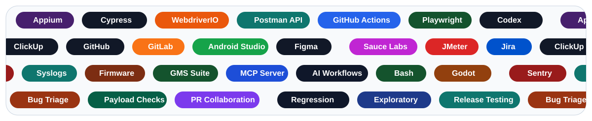
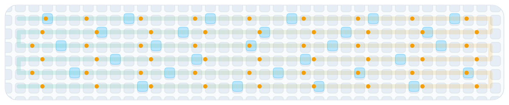

  

<h1 align="center">Usama Afzal</h1>
<h3 align="center">SQA Engineer | Quality Systems, Test Automation, and AI-Assisted Delivery</h3>

  
  
  
  
  

## Summary

I am Usama Afzal, an SQA Engineer with 3+ years of hands-on experience across web, native, hybrid, and device software testing. My work focuses on building reliable quality systems with structured release validation, AI-assisted automation, deep issue investigation, and practical engineering support when teams need momentum.

I work across Appium, WebdriverIO, Cypress, Postman API testing, firmware flashing, ROM and GMS validation, syslog tracing, Sentry-led debugging, payload checks, and bug-fix pull request collaboration.

## What I Bring

- End-to-end QA coverage for web, mobile, hybrid, and device-connected products
- AI-assisted automation with Appium, WebdriverIO, Cypress, JavaScript, and practical workflow tooling
- API testing in Postman, auth flow validation, payload checks, and backend-adjacent debugging
- Firmware flashing, ROM testing, GMS suite validation, and Android device syslog tracing
- Sentry-based issue investigation, regression planning, release support, and fast bug triage
- Bug-fix PR collaboration, internal tooling support, and day-to-day partnership with engineering teams

## Toolbox

  

## Current Scope at Goally

- Support product quality across native app, hybrid app, web, and device software workflows
- Build and maintain automation coverage with Appium, WebdriverIO, Cypress, and AI-assisted test workflows
- Run firmware flashing, ROM validation, GMS testing, syslog tracing, Postman API checks, and release support
- Investigate issues through logs, Sentry, exploratory testing, and targeted bug-fix PR collaboration

## Repositories

### Test Automation

- **[iOS app test automation with Appium](https://github.com/Usama-Afzal-SQA/iOSApp_TestAutomation_Appium)**  
  Appium-based iOS automation for repeatable mobile flows, UI validation, and practical regression coverage.

- **[Android app automation with Appium Inspector](https://github.com/Usama-Afzal-SQA/AndroidApp_Automation_Appium_Inspector)**  
  Android automation work built around Appium Inspector for stable selector strategy, screen tracing, and reliable device checks.

- **[Android app automation through an MCP server](https://github.com/Usama-Afzal-SQA/AndroidApp-TestAutomation-MCPserver)**  
  Mobile testing orchestrated through MCP workflows to make device automation more reusable, observable, and team-friendly.

- **[Web app flow testing with Cypress](https://github.com/Usama-Afzal-SQA/WebApp_TestAutomation_Cypress)**  
  Cypress automation for browser journeys, checkout validation, and release-critical web regressions.

### Other Repositories

- **[Daily standup automation for async teams](https://github.com/Usama-Afzal-SQA/DailyStandUpBot)**  
  A lightweight workflow automation repo that uses GitHub Actions to support daily standup reporting and keep recurring team updates consistent with multiple scheduled cron jobs.

- **[Toybox Rally in Godot](https://github.com/Usama-Afzal-SQA/Toybox-Rally)**  
  A Godot arcade racing prototype that uses sprite sheets for characters, kart selection, AI opponents, item systems, garage flow, and a playable structure built through AI-assisted experimentation.

- **Professional work highlights**  
  Goally delivery across device software testing, Native / Hybrid App / Web QA, Test Automation, firmware validation, backend payload support, Sentry-led debugging, and bug-fix PR delivery.

## Experience Snapshot

<table width="100%">
  <tr>
    <td width="50%" valign="top">
      
       
      <strong>Goally</strong> Denver, CO, USA
       
      <em>SQA Engineer</em>
       
       
      Device software testing
       
      Native / Hybrid App / Web QA
       
      Test Automation
    </td>
    <td width="50%" valign="top">
      
       
      <strong>LUMS</strong> Lahore, Pakistan
       
      <em>Software Engineer Intern</em>
       
       
      API integration, auth flows, and frontend support
       
      in a hands-on engineering environment.
    </td>
  </tr>
</table>

## Certifications and Learning

- Azure AI-900
- PM Essentials
- SQL
- AI Robotics
- HSK 1 and HSK 2
- Mandarin learning track

## QA Activity Trail

  <picture>
    <source media="(prefers-color-scheme: dark)" srcset="./github-contribution-grid-snake-dark.svg" />
    <source media="(prefers-color-scheme: light)" srcset="./github-contribution-grid-snake.svg" />
    
  </picture>

## Let’s Connect

  
  
  
  
  

