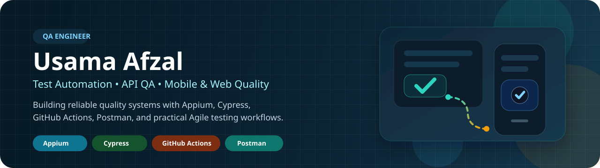

  

<h1 align="center">Usama Afzal</h1>
<h3 align="center">SQA Engineer | Test Automation, Mobile QA, and AI-Assisted Engineering</h3>

  
  
  
  

## Hello, folks

I am Usama Afzal, an SQA Engineer with 3+ years of hands-on experience across web, hybrid, native Android, and connected device quality. I currently work at Goally, where I support product quality across app flows, device validation, firmware testing, backend-related fixes, release readiness, and day-to-day engineering collaboration.

I am especially strong where QA overlaps with engineering. I like building automation, investigating bugs deeply, tracing device and app behavior, and using AI tools to move faster on test coverage, backend payload work, Sentry-driven debugging, and bug-fix pull requests.

## What I Bring

- End-to-end QA for web, mobile, hybrid, and device-connected products
- Test automation with Appium, WebdriverIO, Cypress, JavaScript, and Java
- Firmware flashing, ROM testing, GMS suite testing, and Android device syslog tracing
- API, auth, payload, and backend-adjacent debugging with practical AI support
- Sentry-based issue investigation, release support, regression planning, and fast bug triage
- AI-assisted internal tooling, bug-fix PRs, and team support across QA and engineering workflows

## Toolbox

## Current Scope At Goally

- Own and support quality efforts across native app, hybrid app, web, and device-related workflows
- Build and maintain mobile and browser automation using Appium, WebdriverIO, Cypress, and Sauce Labs
- Work on firmware flashing, ROM validation, GMS testing, and device syslog tracing for Goally devices
- Use Codex and AI workflows to send bug-fix PRs, assist with backend payload tasks, and help unblock product teams faster
- Investigate issues through logs, Sentry, exploratory testing, and targeted validation across releases
- Contribute to process improvements in planning, test coverage, and Agile execution

## Featured Work

- **Daily standup automation for async teams**  
  A GitHub Actions and Slack workflow that collects, organizes, and posts recurring standups for distributed teams.

- **Mobile app regression testing with Appium and WebdriverIO**  
  An Appium-based automation suite focused on mobile login flows, in-app navigation, and repeatable regression coverage.

- **Web checkout and browser flow testing with Cypress**  
  A Cypress automation project built to validate browser journeys and checkout-critical flows with stable end-to-end coverage.

- **Android test automation through an MCP server**  
  An Android automation project where test logic is orchestrated through MCP-based workflows for repeatable mobile testing.

- **Toybox-style kart racer built in Godot**  
  A Godot arcade racing prototype with character selection, AI opponents, item pickups, garage flow, and touch-friendly controls.

- **Professional work highlights**  
  Contributed across Goally automation suites, ClickUp process improvements, firmware and device testing, backend payload support, Sentry-led debugging, and bug-fix PR delivery.

## Experience Snapshot

-  **Goally** — SQA Engineer since November 2022, working across native app, hybrid app, web, and device quality workflows
-  **LUMS, Lahore** — Research Assistant Software Engineer Intern with hands-on API integration, auth flows, and frontend support

## Certifications and Learning

- Azure AI-900
- PM Essentials
- SQL
- AI Robotics
- HSK 1 and HSK 2
- Mandarin learning track

## Contribution Activity

  <picture>
    <source media="(prefers-color-scheme: dark)" srcset="https://raw.githubusercontent.com/Usama-Afzal-SQA/Usama-Afzal-SQA/output/github-contribution-grid-snake-dark.svg" />
    <source media="(prefers-color-scheme: light)" srcset="https://raw.githubusercontent.com/Usama-Afzal-SQA/Usama-Afzal-SQA/output/github-contribution-grid-snake.svg" />
    
  </picture>

## Let’s Connect

- LinkedIn: [linkedin.com/in/usama-afzal-sqa](https://www.linkedin.com/in/usama-afzal-sqa/)
- Linktree: [linktr.ee/Usama_Afzal_SQA](https://linktr.ee/Usama_Afzal_SQA)
- GitHub: [github.com/Usama-Afzal-SQA](https://github.com/Usama-Afzal-SQA)
- Email: [usama5343@gmail.com](mailto:usama5343@gmail.com)
